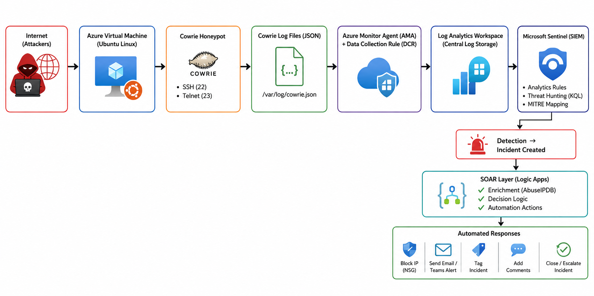

# 🔐 Azure Sentinel SIEM & SOAR Honeypot Monitoring Lab [Development in Progress...]

## 📌 Project Overview

This project demonstrates the design and implementation of a cloud-native Security Operations Centre (SOC) using Microsoft Azure, Microsoft Sentinel, and automated incident response workflows.

A publicly exposed Ubuntu virtual machine hosts a Cowrie honeypot to capture real-world attacker activity targeting SSH and Telnet services. Security telemetry is collected using Azure Monitor Agent (AMA), ingested into Azure Log Analytics Workspace, analysed by Microsoft Sentinel, and automatically processed through Logic Apps for enrichment and response actions.

The solution provides an end-to-end security monitoring pipeline covering:

- Attack simulation and intelligence collection
- Centralised log ingestion
- Threat detection and analytics
- Threat hunting using KQL
- MITRE ATT&CK mapping
- Incident management
- Security orchestration and automated response (SOAR)

---

## 🎯 Project Objectives

The primary objectives of this project were to:

- Deploy a publicly accessible Ubuntu virtual machine in Azure
- Configure a Cowrie SSH/Telnet honeypot
- Capture and analyse attacker interactions
- Collect and centralise honeypot logs
- Configure Azure Monitor Agent (AMA) and Data Collection Rules (DCR)
- Ingest telemetry into Log Analytics Workspace
- Integrate Microsoft Sentinel as the SIEM platform
- Develop analytics rules for attack detection
- Perform threat hunting using Kusto Query Language (KQL)
- Map attacker behaviour to MITRE ATT&CK techniques
- Automate incident enrichment and response using Logic Apps
- Generate actionable security alerts and incidents

---

## 🏗️ Architecture Overview

The following diagram illustrates the complete attack detection and automated response workflow implemented in this project.



### Workflow Summary

1. Internet attackers interact with the Cowrie Honeypot hosted on an Azure Ubuntu VM.
2. Cowrie records attacker activity and stores events in JSON log files.
3. Azure Monitor Agent (AMA) collects the logs using a Data Collection Rule (DCR).
4. Logs are forwarded to Azure Log Analytics Workspace for centralised storage.
5. Microsoft Sentinel analyses incoming events using analytics rules and KQL-based detections.
6. Detected threats generate incidents and alerts.
7. Logic Apps enrich incidents and automate response actions such as IP blocking, alerting, and incident management.

---

## 🔄 Solution Workflow

### 1️⃣ Attack Surface Exposure

A publicly accessible Ubuntu virtual machine is deployed within Microsoft Azure.

The system intentionally exposes:

- SSH (Port 22)
- Telnet (Port 23)

to attract and capture malicious activity from internet-based threat actors.

---

### 2️⃣ Honeypot Data Collection

Cowrie Honeypot is deployed on the virtual machine to emulate vulnerable SSH and Telnet services.

The honeypot records:

- Authentication attempts
- Command execution activity
- Session interactions
- Attacker source IP addresses
- Credential harvesting attempts

All events are stored in JSON format.

---

### 3️⃣ Log Collection & Ingestion

Cowrie log files are collected using:

- Azure Monitor Agent (AMA)
- Data Collection Rules (DCR)

The collected telemetry is securely forwarded to Azure Log Analytics Workspace for centralised storage and analysis.

---

### 4️⃣ Security Monitoring & Detection

Microsoft Sentinel consumes the collected logs and performs:

- Real-time monitoring
- Threat detection
- Incident correlation
- MITRE ATT&CK mapping
- Threat hunting investigations

Analytics rules continuously evaluate incoming telemetry to identify suspicious behaviour.

---

### 5️⃣ Incident Creation

When predefined detection thresholds are met, Microsoft Sentinel automatically generates incidents containing:

- Alert details
- Impacted assets
- Source IP information
- Related entities
- Investigation context

---

### 6️⃣ Automated Response (SOAR)

Microsoft Sentinel triggers Logic Apps workflows to perform automated response actions.

These workflows include:

- Threat intelligence enrichment
- AbuseIPDB reputation checks
- Automated decision making
- Security response orchestration

---

### 7️⃣ Automated Security Actions

Depending on the severity and reputation of the detected threat, the system can automatically:

- Block malicious IP addresses using Network Security Groups (NSGs)
- Send email notifications
- Generate incident comments
- Tag incidents for classification
- Escalate high-priority incidents
- Automatically close benign incidents

---

## 🧰 Technologies Used

| Technology | Purpose |
|------------|----------|
| Microsoft Azure | Cloud infrastructure platform |
| Ubuntu Linux | Honeypot host operating system |
| Cowrie Honeypot | SSH/Telnet attack collection |
| Azure Monitor Agent (AMA) | Log collection |
| Data Collection Rules (DCR) | Data ingestion configuration |
| Log Analytics Workspace | Centralised log repository |
| Microsoft Sentinel | SIEM platform |
| Kusto Query Language (KQL) | Threat hunting and analytics |
| Logic Apps | SOAR automation |
| AbuseIPDB | Threat intelligence enrichment |
| MITRE ATT&CK Framework | Adversary behaviour mapping |

---

## 🔑 Key Features

### 🔍 Threat Detection

- Brute-force attack detection
- Credential harvesting detection
- Suspicious command execution monitoring
- High-frequency attacker identification

### 🕵️ Threat Hunting

- Custom KQL investigations
- Attack pattern analysis
- IP reputation investigation
- Behavioural analysis

### 🚨 Incident Management

- Automated alert generation
- Incident creation and correlation
- MITRE ATT&CK mapping
- Investigation workflows

### ⚡ Security Automation (SOAR)

- Automated enrichment
- IP reputation checks
- Email notifications
- Automated containment actions
- Incident lifecycle management

---

## 📈 Security Outcomes

This solution enables security teams to:

- Monitor real-world attack activity targeting exposed services
- Centralise and analyse security telemetry
- Detect malicious behaviour in near real-time
- Investigate threats using KQL
- Enrich incidents with threat intelligence
- Automate security response actions
- Reduce incident response times
- Improve overall SOC efficiency

---

## 🚀 Skills Demonstrated

- Cloud Security Engineering
- Security Operations Centre (SOC) Operations
- SIEM Deployment and Configuration
- Microsoft Sentinel Administration
- Threat Detection Engineering
- Threat Hunting with KQL
- Incident Investigation and Response
- Security Automation (SOAR)
- Azure Monitoring and Logging
- Threat Intelligence Integration
- MITRE ATT&CK Mapping
- Vulnerability and Attack Surface Monitoring

---

## 📁 Repository Structure

```text
Azure-Sentinel-SOAR-Honeypot-Lab/
│
├── images/
│   ├── architecture-overview.png
│   ├── cowrie-dashboard.png
│   ├── analytics-rules.png
│   ├── playbook.png
│   ├── automation-rule.png
│   ├── email-alert.png
│   └── incidents/
│       └── incident-details.png
│
├── kql/
│   ├── failed-logins.kql
│   ├── attacker-ip-analysis.kql
│   ├── command-execution.kql
│   └── bruteforce-detection.kql
│
└── README.md
```

---

## 🔗 Project Value

This project demonstrates the implementation of a modern cloud-native SOC platform capable of:

- End-to-end attack monitoring
- Centralised log ingestion
- Real-time threat detection
- Threat hunting and investigation
- Automated incident enrichment
- Security orchestration and response (SOAR)
- Threat intelligence integration
- Incident lifecycle management

---

## ⭐ Author

**Simon Yusuf Enoch**

Cybersecurity Analyst | Threat Detection | SIEM Engineering | Cloud Security
